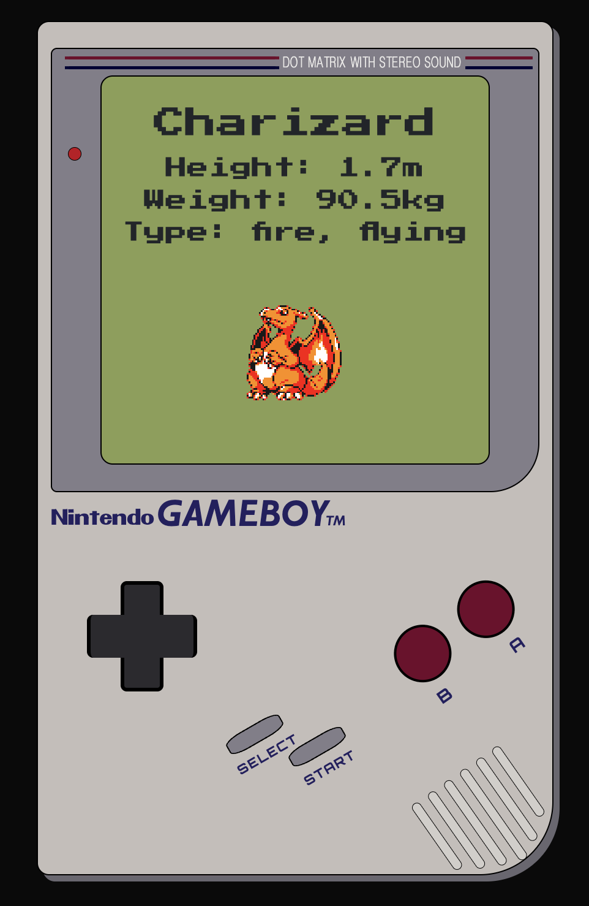

# Pokédex Web App

## App Features

-   Loads Pokémon data from PokéApi
-   Displays each pokemon as a styled button with name and image
-   Button click displays styled modal with
    -   Name
    -   Height
    -   Weight
    -   Type
    -   Image
-   Infinite Scroll Functionality
-   Responsive layout

## Technology Used

-   HTML5
-   CSS
-   JavaScript
-   Bootstrap
-   PokeApi

## Future Developments

-   Search functionality
-   Filtering by pokémon type
-   Improved alt sprite support

## Learning Experience

-   How to structure JavaScript with modular patterns
-   How to handle asynchronous code and fetch data from a REST API
-   DOM manipulation and dynamically creating elements
-   Creating modals and handling UI state with JavaScript.
-   Styling responsive layouts with Bootstrap and custom CSS

    
    
    
    
    
